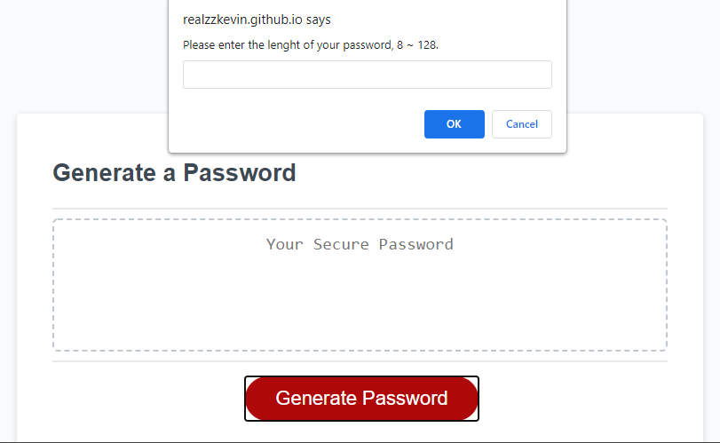
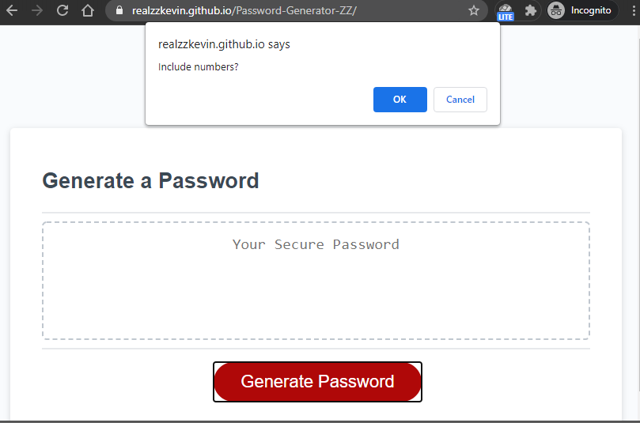
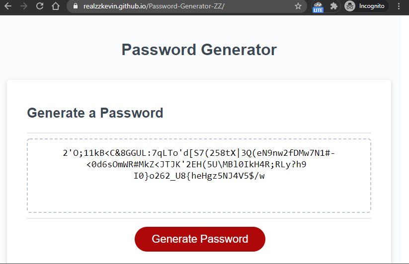

# Password Generator

## Description
A simple password generator that’s written in javascript and HTML. This program can randomly generate a password that meets user-selected criteria. It will allow users to customize their password criteria, such as the length of passwords, and different character sets in passwords.

## Features
* A convenient user interface.

* Generates password length from 8 to 128.

* Character sets customization: Support numeric, lowercase, uppercase, and special case characters.

## Screenshots
 * Choose password length.

* Select character sets.

* Result
  

## License

This project is using the [MIT](LICENSE) license.

## Link

[Password Generator github page](https://github.com/realzzkevin/Password-Generator-ZZ)

[Password Generator page](https://realzzkevin.github.io/Password-Generator-ZZ/)